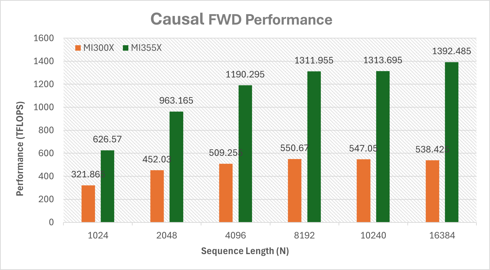
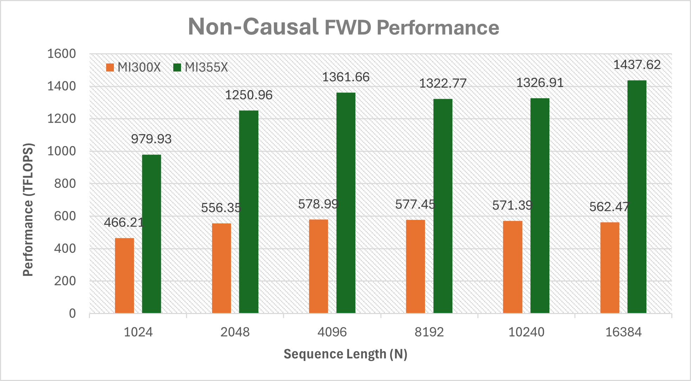
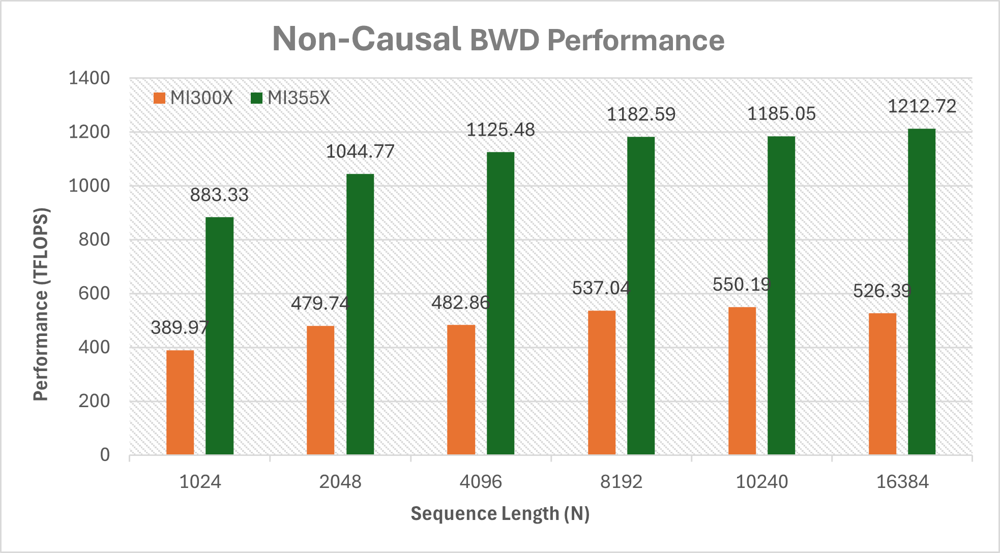

# aiter mha kernel

this is an example how to benchmark aiter mha fwd/bwd kernel through c++ API: `aiter::mha_fwd`, `aiter::mha_fwd_splitkv`, `aiter::mha_bwd`.

## build and run
We provide a simple script `build_mha.sh` to build the device library as well as a simple executable:
```
# this will build fwd_v3(asm) only
bash build_mha.sh fwd_v3

# this will build bwd_v3(asm) only
bash build_mha.sh bwd_v3

# this will build full fwd(asm + ck)
bash build_mha.sh fwd

# this will build full bwd(asm + ck)
bash build_mha.sh bwd

# this will build full fwd+bwd
bash build_mha.sh
```
Device library `libmha_fwd.so` and `libmha_bwd.so` will be built under current folder, and corresponding executables `benchmark_mha_fwd` and/or `benchmark_mha_bwd` will also be built. You can type `./benchmark_mha_fwd -?` to list all the supported arguments. You can also refer to the `smoke_test_*` script under this folder for a list of quick test.

To benchmark asm kernel, try following commands:
```
# Set this env before you run
export AITER_ASM_DIR={path_to_aiter}/hsa/{arch_name}/

# fwd_v3
./benchmark_mha_fwd -prec=bf16 -b=1 -h=64 -d=128 -s=8192 -iperm=1 -operm=1 -mask=1 -lse=1 -fwd_v3=1 -mode=0 -kname=1 -v=0

# bwd_v3 with atomic fp16
./benchmark_mha_bwd -prec=bf16 -b=1 -h=64 -d=128 -s=8192 -iperm=1 -operm=1 -mask=1 -bwd_v3=1 -v3_atomic_fp32=0 -v3_bf16_cvt=2 -mode=0 -kname=1 -v=0

# bwd_v3 with atomic fp32
./benchmark_mha_bwd -prec=bf16 -b=1 -h=64 -d=128 -s=8192 -iperm=1 -operm=1 -mask=1 -bwd_v3=1 -v3_atomic_fp32=1 -v3_bf16_cvt=2 -mode=0 -kname=1 -v=0
```

## how to build/link aiter mha in your c++ project
We recommend you download the source code of `aiter` and put it under the `3rdparty` submodule folder of your project (you don't need to install `aiter`). We use a way simliar to [cpp_extension](https://github.com/pytorch/pytorch/blob/main/torch/utils/cpp_extension.py) to build the device kernel library without `torch` dependency (you don't need to install `torch`), so it's easy to embed `aiter` into other project.

Basically the build process will be similiar to that inside `build_mha.sh` script.

First, you need to build the device kernel into a `so`, which is done by a python `compile.py` inside this folder.
```
python3 compile.py
```
you can also call this python script from different directory, the generated `.so` will always under current directory.

Second, link the `.so` into your executable and compile. You need specify the correct path through `-L` inorder to link to the device lib. You also need to specify the include directory through `-I`, for this example you need set `$TOP_DIR/csrc/include` for the `aiter` API header, and the dependent ck header `$TOP_DIR/3rdparty/composable_kernel/include` and `$TOP_DIR/3rdparty/composable_kernel/example/ck_tile/01_fmha/`. Please refer to `build_mha.sh` for detailed command


## `aiter::mha_fwd` supported arguments configuration
Note: For optimal performance, the input configuration preferentially matches the supported parameters of the asm kernel type.

you can also call the corresponding executables `benchmark_mha_fwd` to check whether the arguments are supported by asm kernel with `-is_v3_check=1` condition, try following commands:
```
    ./benchmark_mha_fwd -prec=fp16 -b=1 -h=64 -d=128 -s=8192 -iperm=1 -operm=1 -mask=1 -lse=1 -fwd_v3=1 -mode=0 -kname=1 -v=0 -is_v3_check=1
```
| data_type    | hdim_q  | hdim_v  | mode           | mask_type                            | general constraints            | kernel type | mi308 | mi300/325 | mi350/355  |
|--------------|---------|---------|----------------|--------------------------------------|--------------------------------|-------------|-------|-----------|------------|
| bf16         | 128     | 128     | batch or group | no_mask or causal(mask_bottom_right) | bias, dropout is not supported | asm         | y     | y         | y          |
| bf16         | 192     | 128     | batch or group | no_mask or causal(mask_bottom_right) | bias, dropout is not supported | asm         | n     | n         | y          |
| fp16 or bf16 | [0,32]  | [0,32]  | batch or group | no_mask or causal or swa             | unconstrained                  | ck          | y     | y         | y          |
| fp16 or bf16 | (0,64]  | (0,64]  | batch or group | no_mask or causal or swa             | unconstrained                  | ck          | y     | y         | y          |
| fp16 or bf16 | (0,128] | (0,128] | batch or group | no_mask or causal or swa             | unconstrained                  | ck          | y     | y         | y          |
| fp16 or bf16 | (0,192] | (0,128] | batch or group | no_mask or causal or swa             | unconstrained                  | ck          | y     | y         | y          |
| fp16 or bf16 | (0,256] | (0,256] | batch or group | no_mask or causal or swa             | unconstrained                  | ck          | y     | y         | y          |


## `aiter::mha_bwd` supported arguments configuration
Note: For optimal performance, the input configuration preferentially matches the supported parameters of the asm kernel type.

you can also call the corresponding executables `benchmark_mha_bwd` to check whether the arguments are supported by asm kernel with `-is_v3_check=1` condition, try following commands:
```
    ./benchmark_mha_bwd -prec=bf16 -b=1 -h=64 -d=256 -s=8192 -iperm=1 -operm=1 -mask=1 -bwd_v3=1 -v3_atomic_fp32=0 -v3_bf16_cvt=2 -mode=0 -kname=1 -v=0 -is_v3_check=1
```

| data_type    | hdim_q       | hdim_v          | mode           | mask_type                | dq_accumulation          | general constraints                                     | shape&stride constraints                                                                                                                                                                                                               | kernel type(asm/ck) | mi308 | mi300/325 | mi350/355                        |
|--------------|--------------|-----------------|----------------|--------------------------|--------------------------|---------------------------------------------------------|----------------------------------------------------------------------------------------------------------------------------------------------------------------------------------------------------------------------------------------|---------------------|-------|-----------|----------------------------------|
| fp16 or bf16 | (128,192]/x8 | equal to hdim_q | batch or group | no_mask or causal        | atomic_f32               | bias, dbisa, dropout and deterministic is not supported | dq_acc only support BHSD                                                                                                                                                                                                               | asm                 | y     | y         | n                                |
| fp16 or bf16 | (64,128]/x8  | equal to hdim_q | batch          | no_mask or causal        | atomic_f32 or atomic_f16 | bias, dbisa, dropout and deterministic is not supported | dq_acc only support BHSD when dq_accumulation is atomic_f32. The shape&stride of q and do must be the same and the shape&stride of k and v must be the same and seqlen_q must be equal to seqlen_k when dq_accumulation is atomic_f16. | asm                 | y     | y         | bf16;hd128;sq == sk;sq % 256==0  |
| fp16 or bf16 | (64,128]/x8  | equal to hdim_q | group          | no_mask or causal        | atomic_f32               | bias, dbisa, dropout and deterministic is not supported | dq_acc only support BHSD                                                                                                                                                                                                               | asm                 | y     | y         | bf16;hd128;sq == sk;sq % 256==0  |
| fp16 or bf16 | 64           | equal to hdim_q | batch          | no_mask or causal        | atomic_f32 or atomic_f16 | bias, dbisa, dropout and deterministic is not supported | dq_acc only support BHSD when dq_accumulation is atomic_f32. The shape&stride of q and do must be the same and the shape&stride of k and v must be the same and seqlen_q must be equal to seqlen_k when dq_accumulation is atomic_f16. | asm                 | y     | y         | n                                |
| fp16 or bf16 | 64           | equal to hdim_q | group          | no_mask or causal        | atomic_f32               | bias, dbisa, dropout and deterministic is not supported | dq_acc only support BHSD                                                                                                                                                                                                               | asm                 | y     | y         | n                                |
| fp16 or bf16 | [0,32]       | [0,32]          | batch or group | no_mask or causal or swa | atomic_f32 or atomic_f16 | unconstrained                                           | unconstrained                                                                                                                                                                                                                          | ck                  | y     | y         | y                                |
| fp16 or bf16 | (0,64]       | (0,64]          | batch or group | no_mask or causal or swa | atomic_f32 or atomic_f16 | unconstrained                                           | unconstrained                                                                                                                                                                                                                          | ck                  | y     | y         | y                                |
| fp16 or bf16 | (0,128]      | (0,128]         | batch or group | no_mask or causal or swa | atomic_f32 or atomic_f16 | unconstrained                                           | unconstrained                                                                                                                                                                                                                          | ck                  | y     | y         | y                                |
| fp16 or bf16 | (0,256]      | (0,256]         | batch or group | no_mask or causal or swa | atomic_f32 or atomic_f16 | unconstrained                                           | unconstrained                                                                                                                                                                                                                          | ck                  | y     | y         | y                                |


## the asm kernel performance of the attention forwards and attention backwards.
the performance data was tested under the conditions of BF16 and BSHD in batch mode.



*Figure 1: Evaluating GQA attention forwards performance under the conditions of batch=8, q_nheads=64 and kv_nheads=8.*



*Figure 2: Evaluating GQA attention backwards(a16) performance under the conditions of batch=8, q_nheads=64 and kv_nheads=8.*

**More performance test results are shown in the table below:**

| batch | q_nheads | kv_nheads | seqlen_q | seqlen_kv | hdim | causal | FWD(TFLOPS) |          | BWD-a16(TFLOPS) |          | BWD-a32(TFLOPS) |          |
|-------|----------|-----------|----------|-----------|------|--------|-------------|----------|-----------------|----------|-----------------|----------|
|       |          |           |          |           |      |        | MI300X      | MI355X   | MI300X          | MI355X   | MI300X          | MI355X   |
| 1     | 32       | 8         | 1024     | 1024      | 128  | 0      | 338.07      | 613.48   | 344.03          | 535.63   | 313.67          | 519.42   |
| 1     | 32       | 8         | 2048     | 2048      | 128  | 0      | 513.45      | 1194.46  | 311.9           | 852.16   | 269.19          | 701.34   |
| 1     | 32       | 8         | 4096     | 4096      | 128  | 0      | 527.73      | 1177.11  | 472.01          | 1108.22  | 423.53          | 781.81   |
| 1     | 32       | 8         | 8192     | 8192      | 128  | 0      | 558.17      | 1396     | 524.15          | 1183.4   | 481.28          | 818.43   |
| 1     | 32       | 8         | 10240    | 10240     | 128  | 0      | 549.73      | 1421.77  | 536.48          | 1199.96  | 491.28          | 830.49   |
| 4     | 32       | 8         | 1024     | 1024      | 128  | 0      | 458.41      | 956.51   | 390.4           | 851.84   | 353.44          | 660.81   |
| 4     | 32       | 8         | 2048     | 2048      | 128  | 0      | 504.8       | 1092.82  | 459.52          | 1013.48  | 430.81          | 745.42   |
| 4     | 32       | 8         | 4096     | 4096      | 128  | 0      | 577.16      | 1343.02  | 505.82          | 1131.11  | 457.38          | 801.75   |
| 4     | 32       | 8         | 8192     | 8192      | 128  | 0      | 574.62      | 1407.46  | 491.07          | 1185.11  | 458.72          | 830.84   |
| 4     | 32       | 8         | 10240    | 10240     | 128  | 0      | 584.66      | 1414.26  | 535.92          | 1194.01  | 476.64          | 800.43   |
| 8     | 32       | 8         | 1024     | 1024      | 128  | 0      | 459.43      | 891.28   | 379.88          | 863.71   | 329.69          | 664.81   |
| 8     | 32       | 8         | 2048     | 2048      | 128  | 0      | 543.77      | 1175.5   | 475.12          | 994.07   | 426.56          | 757.61   |
| 8     | 32       | 8         | 4096     | 4096      | 128  | 0      | 567.82      | 1351.12  | 519.34          | 1138.77  | 460.44          | 807.57   |
| 8     | 32       | 8         | 8192     | 8192      | 128  | 0      | 585.29      | 1406.47  | 518.07          | 1183.94  | 475.56          | 834.32   |
| 8     | 32       | 8         | 10240    | 10240     | 128  | 0      | 577.5       | 1366.47  | 534.98          | 1189.83  | 480.87          | 840.56   |
| 1     | 64       | 8         | 1024     | 1024      | 128  | 0      | 418.36      | 1003.73  | 292.68          | 806.07   | 266.06          | 644.69   |
| 1     | 64       | 8         | 2048     | 2048      | 128  | 0      | 485.45      | 1018.07  | 437.26          | 965.91   | 393.6           | 724.91   |
| 1     | 64       | 8         | 4096     | 4096      | 128  | 0      | 546.34      | 1305.83  | 524.33          | 1140.11  | 470.15          | 788.39   |
| 1     | 64       | 8         | 8192     | 8192      | 128  | 0      | 591.37      | 1412.91  | 473             | 1159.28  | 441.82          | 822.75   |
| 1     | 64       | 8         | 10240    | 10240     | 128  | 0      | 572.09      | 1417.43  | 503.78          | 1195.97  | 460             | 831.34   |
| 4     | 64       | 8         | 1024     | 1024      | 128  | 0      | 440.07      | 914.7    | 376.75          | 860.99   | 340.25          | 672.49   |
| 4     | 64       | 8         | 2048     | 2048      | 128  | 0      | 554.8       | 1201.6   | 477.46          | 1036.33  | 425.74          | 757.48   |
| 4     | 64       | 8         | 4096     | 4096      | 128  | 0      | 573.6       | 1360.79  | 510.76          | 1117.94  | 456.78          | 804.47   |
| 4     | 64       | 8         | 8192     | 8192      | 128  | 0      | 592.16      | 1407.58  | 511.65          | 1170.92  | 468.71          | 798      |
| 4     | 64       | 8         | 10240    | 10240     | 128  | 0      | 578.93      | 1358.41  | 535.75          | 1194.42  | 479.52          | 834.79   |
| 8     | 64       | 8         | 1024     | 1024      | 128  | 0      | 466.21      | 979.93   | 389.97          | 883.33   | 357.82          | 692.81   |
| 8     | 64       | 8         | 2048     | 2048      | 128  | 0      | 556.35      | 1250.96  | 479.74          | 1044.77  | 430.07          | 764.92   |
| 8     | 64       | 8         | 4096     | 4096      | 128  | 0      | 578.99      | 1361.66  | 482.86          | 1125.48  | 445.73          | 803.05   |
| 8     | 64       | 8         | 8192     | 8192      | 128  | 0      | 577.45      | 1322.77  | 537.04          | 1182.59  | 475.07          | 806.58   |
| 8     | 64       | 8         | 10240    | 10240     | 128  | 0      | 571.39      | 1326.91  | 550.19          | 1185.05  | 480.35          | 777.5    |
| 1     | 64       | 4         | 1024     | 1024      | 128  | 0      | 383.85      | 1017.04  | 291.27          | 827.15   | 264.63          | 637.29   |
| 1     | 64       | 4         | 2048     | 2048      | 128  | 0      | 506.89      | 1077.21  | 443.31          | 977.22   | 396.33          | 727.98   |
| 1     | 64       | 4         | 4096     | 4096      | 128  | 0      | 549.2       | 1299.05  | 520.99          | 1018.96  | 467.24          | 787.19   |
| 1     | 64       | 4         | 8192     | 8192      | 128  | 0      | 591.77      | 1406.35  | 465.87          | 1183.78  | 439.94          | 823.07   |
| 1     | 64       | 4         | 10240    | 10240     | 128  | 0      | 571.59      | 1429.39  | 505.49          | 1196.97  | 459.64          | 834.05   |
| 4     | 64       | 4         | 1024     | 1024      | 128  | 0      | 460.34      | 923.01   | 395.21          | 859.64   | 332.54          | 662.93   |
| 4     | 64       | 4         | 2048     | 2048      | 128  | 0      | 556.35      | 1224.58  | 474.83          | 1040.78  | 424.12          | 757.93   |
| 4     | 64       | 4         | 4096     | 4096      | 128  | 0      | 575.69      | 1360.36  | 519.08          | 1131.7   | 457.51          | 803.23   |
| 4     | 64       | 4         | 8192     | 8192      | 128  | 0      | 590.93      | 1411.19  | 513.66          | 1184.23  | 469.72          | 816.86   |
| 4     | 64       | 4         | 10240    | 10240     | 128  | 0      | 582.64      | 1356.52  | 534.39          | 1191.66  | 475.49          | 830.14   |
| 8     | 64       | 4         | 1024     | 1024      | 128  | 0      | 497.15      | 1016.32  | 389.54          | 887.19   | 360.39          | 694.07   |
| 8     | 64       | 4         | 2048     | 2048      | 128  | 0      | 556.22      | 1262.85  | 478.01          | 1023.27  | 426.77          | 761.21   |
| 8     | 64       | 4         | 4096     | 4096      | 128  | 0      | 581.34      | 1362.68  | 481.35          | 1137.56  | 438.77          | 796.47   |
| 8     | 64       | 4         | 8192     | 8192      | 128  | 0      | 583.23      | 1324     | 536.72          | 1180.92  | 475.68          | 758.9    |
| 8     | 64       | 4         | 10240    | 10240     | 128  | 0      | 566.17      | 1325.23  | 550.05          | 1186.44  | 478.88          | 841.68   |
| 1     | 64       | 8         | 16384    | 16384     | 128  | 0      | 547.78      | 1437.62  | 519.21          | 1212.72  | 441.55          | 843.54   |
| 1     | 64       | 4         | 16384    | 16384     | 128  | 0      | 549.09      | 1432.94  | 516.26          | 1200.31  | 448.83          | 843.24   |
| 1     | 32       | 8         | 1024     | 1024      | 128  | 1      | 130.62      | 233.12   | 177.565         | 211.91   | 166.78          | 210.315  |
| 1     | 32       | 8         | 2048     | 2048      | 128  | 1      | 255.105     | 577.28   | 317.3           | 506.615  | 295.865         | 479.925  |
| 1     | 32       | 8         | 4096     | 4096      | 128  | 1      | 467.805     | 949.325  | 317.685         | 922.385  | 296.025         | 713.075  |
| 1     | 32       | 8         | 8192     | 8192      | 128  | 1      | 522.68      | 1247.73  | 436.13          | 1062.76  | 388.235         | 765.75   |
| 1     | 32       | 8         | 10240    | 10240     | 128  | 1      | 440.12      | 1200.645 | 513.85          | 1002.585 | 244.705         | 759.32   |
| 4     | 32       | 8         | 1024     | 1024      | 128  | 1      | 334.005     | 720.995  | 257.115         | 547.555  | 226.39          | 465.04   |
| 4     | 32       | 8         | 2048     | 2048      | 128  | 1      | 419.435     | 809.835  | 377.51          | 783.305  | 330.23          | 431.525  |
| 4     | 32       | 8         | 4096     | 4096      | 128  | 1      | 486.73      | 1130.115 | 464.83          | 957.41   | 416.54          | 723.945  |
| 4     | 32       | 8         | 8192     | 8192      | 128  | 1      | 547.09      | 1318.92  | 468.205         | 1069.935 | 422.835         | 775.46   |
| 4     | 32       | 8         | 10240    | 10240     | 128  | 1      | 527.705     | 1342.995 | 474.205         | 1088.865 | 432.545         | 767.995  |
| 8     | 32       | 8         | 1024     | 1024      | 128  | 1      | 311.385     | 623.93   | 301.495         | 545.225  | 258.26          | 457.025  |
| 8     | 32       | 8         | 2048     | 2048      | 128  | 1      | 412.99      | 894.45   | 374.255         | 806.96   | 326.355         | 620.48   |
| 8     | 32       | 8         | 4096     | 4096      | 128  | 1      | 513.1       | 1166.875 | 454.36          | 967.905  | 409.05          | 726.06   |
| 8     | 32       | 8         | 8192     | 8192      | 128  | 1      | 537.36      | 1316.805 | 491.78          | 1066.705 | 441.4           | 772.67   |
| 8     | 32       | 8         | 10240    | 10240     | 128  | 1      | 556.045     | 1334.865 | 495.15          | 1087.61  | 443.78          | 794.245  |
| 1     | 64       | 8         | 1024     | 1024      | 128  | 1      | 228.54      | 432.565  | 283.58          | 386.805  | 242.43          | 370.42   |
| 1     | 64       | 8         | 2048     | 2048      | 128  | 1      | 392.425     | 936.435  | 279.72          | 725.61   | 257.855         | 598.985  |
| 1     | 64       | 8         | 4096     | 4096      | 128  | 1      | 474.385     | 1046.085 | 420.265         | 941.16   | 378.155         | 694.125  |
| 1     | 64       | 8         | 8192     | 8192      | 128  | 1      | 518.29      | 1300.105 | 481.895         | 1064.56  | 433.285         | 765.21   |
| 1     | 64       | 8         | 10240    | 10240     | 128  | 1      | 510.895     | 1338.005 | 501.055         | 1092.475 | 447.995         | 788.92   |
| 4     | 64       | 8         | 1024     | 1024      | 128  | 1      | 326.51      | 638.705  | 311.005         | 571.615  | 266.9           | 470.95   |
| 4     | 64       | 8         | 2048     | 2048      | 128  | 1      | 425.735     | 899.845  | 377.225         | 796.81   | 326.805         | 621.295  |
| 4     | 64       | 8         | 4096     | 4096      | 128  | 1      | 513.79      | 1174.92  | 449             | 971.395  | 391.235         | 722.205  |
| 4     | 64       | 8         | 8192     | 8192      | 128  | 1      | 540.515     | 1319.225 | 482.505         | 1067.805 | 434.645         | 774.25   |
| 4     | 64       | 8         | 10240    | 10240     | 128  | 1      | 557.475     | 1337.965 | 493.745         | 1090.925 | 442.51          | 792.12   |
| 8     | 64       | 8         | 1024     | 1024      | 128  | 1      | 321.865     | 626.57   | 324.22          | 576.345  | 265.08          | 484.34   |
| 8     | 64       | 8         | 2048     | 2048      | 128  | 1      | 452.03      | 963.165  | 382.1           | 817.49   | 347.89          | 630.43   |
| 8     | 64       | 8         | 4096     | 4096      | 128  | 1      | 509.255     | 1190.295 | 457.05          | 972.25   | 402.18          | 710.905  |
| 8     | 64       | 8         | 8192     | 8192      | 128  | 1      | 550.67      | 1311.955 | 474.02          | 1067.89  | 432.715         | 772.605  |
| 8     | 64       | 8         | 10240    | 10240     | 128  | 1      | 547.05      | 1313.695 | 489.075         | 1084.75  | 439.785         | 792.91   |
| 1     | 64       | 4         | 1024     | 1024      | 128  | 1      | 229.09      | 421.615  | 265.11          | 385.735  | 238.755         | 376.975  |
| 1     | 64       | 4         | 2048     | 2048      | 128  | 1      | 407.525     | 949.635  | 277.86          | 725.085  | 254.375         | 580.43   |
| 1     | 64       | 4         | 4096     | 4096      | 128  | 1      | 476.26      | 1058.9   | 418.73          | 937.725  | 384.585         | 705.6    |
| 1     | 64       | 4         | 8192     | 8192      | 128  | 1      | 519.32      | 1318.15  | 480.06          | 1062.725 | 442.955         | 768.16   |
| 1     | 64       | 4         | 10240    | 10240     | 128  | 1      | 515.275     | 1348.155 | 499.72          | 1087.905 | 459.745         | 785.905  |
| 4     | 64       | 4         | 1024     | 1024      | 128  | 1      | 314.82      | 661.045  | 324.22          | 580      | 264.795         | 470.865  |
| 4     | 64       | 4         | 2048     | 2048      | 128  | 1      | 426.77      | 896.095  | 374.96          | 813.51   | 331.95          | 620.01   |
| 4     | 64       | 4         | 4096     | 4096      | 128  | 1      | 524.585     | 1182.87  | 453.97          | 968.96   | 405.02          | 713.075  |
| 4     | 64       | 4         | 8192     | 8192      | 128  | 1      | 540.935     | 1324.275 | 478.735         | 1067.48  | 430.95          | 749.805  |
| 4     | 64       | 4         | 10240    | 10240     | 128  | 1      | 560.63      | 1346.46  | 491.435         | 1091.17  | 441.345         | 780.665  |
| 8     | 64       | 4         | 1024     | 1024      | 128  | 1      | 348.76      | 663.48   | 315.035         | 589.73   | 267.48          | 493.61   |
| 8     | 64       | 4         | 2048     | 2048      | 128  | 1      | 461.89      | 983.355  | 400.31          | 823.795  | 352.7           | 626.72   |
| 8     | 64       | 4         | 4096     | 4096      | 128  | 1      | 513.795     | 1196.675 | 456.415         | 976.635  | 402.68          | 701.24   |
| 8     | 64       | 4         | 8192     | 8192      | 128  | 1      | 552.78      | 1318.92  | 473.41          | 1065.225 | 434.51          | 774.87   |
| 8     | 64       | 4         | 10240    | 10240     | 128  | 1      | 548.65      | 1313.945 | 488.145         | 1087.4   | 435.745         | 793.095  |
| 1     | 64       | 8         | 16384    | 16384     | 128  | 1      | 541.55      | 1392.485 | 458.075         | 1162.805 | 412.04          | 808.93   |
| 1     | 64       | 4         | 16384    | 16384     | 128  | 1      | 544.1       | 1398.14  | 458.065         | 1131.305 | 419.975         | 809.685  |

